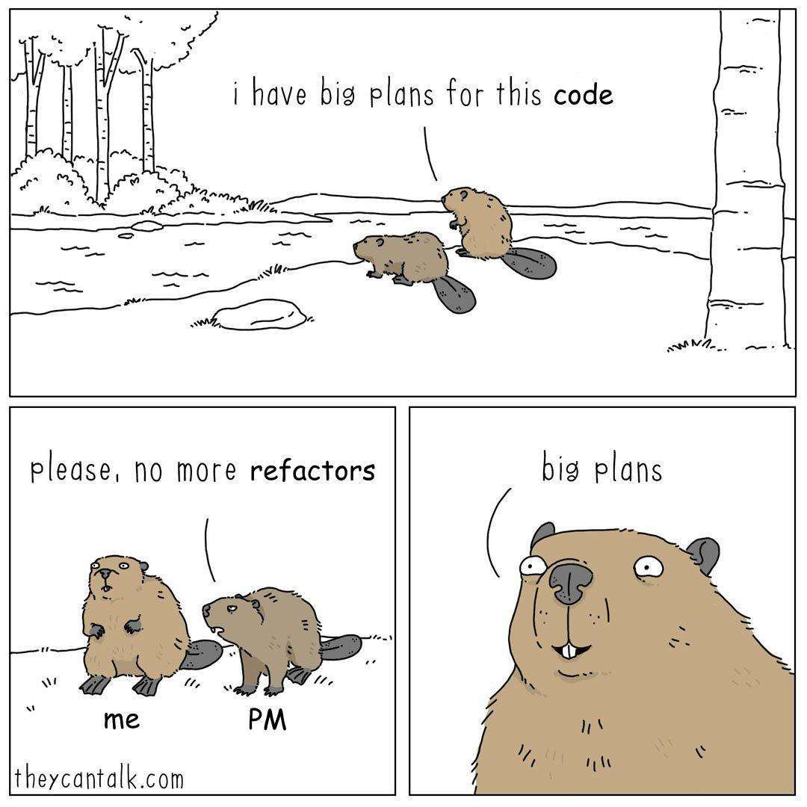

# Hey There! 👋
**I'm a back-end developer, dreaming to over-complicate stuff for a living.**

### Few things about me
- I hate dynamically typed languages. I guess it's a scar that JavaScript left in me.
- I'm a daily driver and a big fan of Linux.  
  Feel free to check out my dotfiles for [**Arch Linux**](https://github.com/zakuciael/dotfiles) and [**NixOS**](https://github.com/zakuciael/nixos-dotfiles).
- I'm fascinated with DevOps solutions, so I've migrated my VPS from Docker to single-node Kubernetes, although I gained nothing from it except experience.
- Back in the day, I was called **"Mr. Config"**, because I loved to configure stuff instead of working, but now I choose **zero-config** solutions whenever I can.
- I'm an **overthinker** at heart, but I try to fight it off.

### Tech that I've worked with or I'm passionate about
<picture>
 <!-- User prefers light mode: -->
  <source srcset="https://skillicons.dev/icons?perline=10&theme=dark&i=rust%2Cts%2Cjs%2Chtml%2Ccss%2Cgit%2Cgithub%2Cgithubactions%2Cnodejs%2Cpnpm%2Ctailwind%2Creact%2Cnextjs%2Cpostgresql%2Cmongodb%2Cplanetscale%2Cprisma%2Cdocker%2Ckubernetes%2Cnginx%2Cterraform%2Ccloudflare%2Ctauri%2Celectron%2Cnestjs%2Cexpress%2Clinux%2Carch%2Cnix" media="(prefers-color-scheme: light)"/>

  <!-- User prefers dark mode: -->
  <source srcset="https://skillicons.dev/icons?perline=10&theme=light&i=rust%2Cts%2Cjs%2Chtml%2Ccss%2Cgit%2Cgithub%2Cgithubactions%2Cnodejs%2Cpnpm%2Ctailwind%2Creact%2Cnextjs%2Cpostgresql%2Cmongodb%2Cplanetscale%2Cprisma%2Cdocker%2Ckubernetes%2Cnginx%2Cterraform%2Ccloudflare%2Ctauri%2Celectron%2Cnestjs%2Cexpress%2Clinux%2Carch%2Cnix"  media="(prefers-color-scheme: dark)"/>

  <!-- User has no color preference: -->
  
</picture>